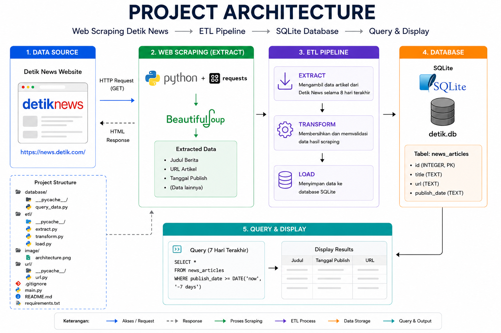

# Technical Test Alphalitical

---

### Business Understanding

- This project uses **web scraping** techniques with Python to collect news article data from the **Detik News** website over the last 8 days.
- The scraping process uses the `requests` library to retrieve HTML content from the website and `BeautifulSoup` to parse and extract data from the HTML structure.

---

### Architecture

---

### ETL Process

- **Extract** → Retrieves HTML content from the Detik News index page and extracts data such as news titles, article URLs, and publish dates.
- **Transform** → Cleans and validates the scraped data before storing it in the database.
- **Load** → Stores the scraped data into an SQLite database in the `news_articles` table.

---

### Database Folder

The `database` folder is used to store processes related to querying and displaying data from the SQLite database.

- `query_data.py` Contains SQL queries to retrieve news articles published within the last 7 days from the `news_articles` table.

---

### Handling Scraping Challenges

#### Common ways websites prevent web scraping

- `Rate Limiting` → Websites limit too many requests from the same IP address within a short period.
- `CAPTCHA` → Used to distinguish between humans and bots.
- `IP Blocking` → Suspicious IP addresses may be blocked by the website.
- `User-Agent Detection` → Requests without browser headers can be detected as bots.
- `Dynamic Content` → Some websites use JavaScript, so data does not appear directly during scraping.

#### How to avoid getting blocked while scraping

- `Use User-Agent headers` → Makes requests look like normal browser traffic.
- `Add delays between requests` → Prevents sending too many requests in a short time.
- `Respect robots.txt` → Follows the scraping rules defined by the website.
- `Use Selenium or Playwright` → Useful for websites that use JavaScript rendering.
- `Avoid excessive scraping` → Perform scraping responsibly to reduce blocking risk.

---

### Run Program

- `py main.py`
- `python main.py`
